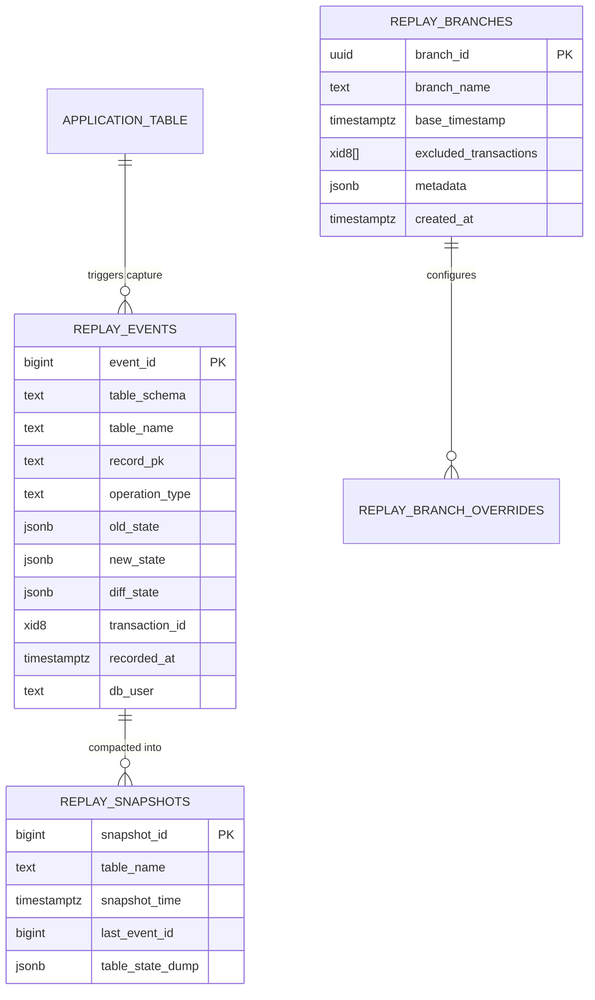
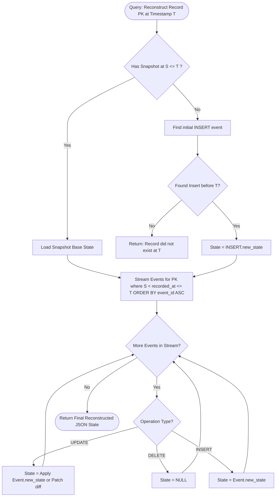
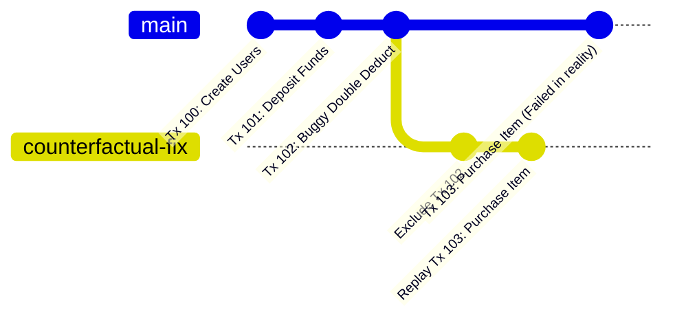

# ReplayDB — Temporal Database Debugging & Replay System
## Master Project Planning Document (`PLAN.md`)

---

## Today's Starting Point

As of the current project baseline, the status of ReplayDB is strictly at the foundational planning and conceptual phase:

- **Current Status**:
  - Project proposal and architectural concept formulated.
  - Academic review presentation created.
  - Master development roadmap and specification document (`PLAN.md`) defined.
- **Implementation State**:
  - Zero application code, triggers, or backend services are marked as implemented or deployed.
  - No synthetic benchmarks, falsified performance results, or premature claims of completion exist.
- **Immediate Next Technical Step**:
  - **Phase 1 & Phase 2**: Setting up the PostgreSQL target database environment and implementing the initial trigger-based Change Data Capture (CDC) mechanism.

---

## 1. Project Overview

Modern relational database management systems (RDBMS), such as PostgreSQL, are optimized to maintain, index, and query the **current state** of application data under ACID guarantees. When a record is updated or deleted, the previous values are overwritten or marked for garbage collection (e.g., via PostgreSQL MVCC vacuuming). 

**ReplayDB** is a database debugging and temporal analysis platform designed to work alongside PostgreSQL. It captures granular row-level data modifications, structures them into an immutable ledger of historical events, and provides a programmatic and visual interface to inspect, reconstruct, and branch database states across arbitrary points in time.

The system serves as a temporal flight recorder and time-travel debugger for database-backed applications, enabling engineers to answer post-incident forensics questions that traditional logging, point-in-time recovery (PITR), and application audit tables cannot easily resolve.

---

## 2. Problem Statement

When production data corruption, logic bugs, or silent synchronization errors occur, engineers routinely encounter severe visibility barriers:

1. **Destructive State Overwrites**: Conventional tables reflect *what* the data is right now, but discard *how* and *when* specific column transitions occurred.
2. **Disconnected Application Logs vs. DB State**: Application logs (`INFO`, `DEBUG`) record intention, but they often diverge from actual committed database states due to unhandled rollbacks, race conditions, or unlogged direct SQL updates.
3. **Imprecise Forensic Attribution**: Standard audit tables (if manually implemented) rarely correlate row mutations to the exact PostgreSQL transaction ID (`txid` / `pg_current_xact_id()`) or cross-table mutations executed within the same commit boundary.
4. **Coarse-Grained Recovery Mechanisms**: PostgreSQL Write-Ahead Log (WAL) archiving and Point-in-Time Recovery (PITR) operate at the cluster or block storage level. Restoring a multi-terabyte cluster just to inspect the state of a single customer's orders 4 hours ago is slow, operationally expensive, and intrusive.
5. **No Counterfactual "What-If" Analysis**: Developers cannot cleanly simulate what a database state would look like if a specific erroneous transaction had been omitted or altered, without writing ad-hoc migration scripts or jeopardizing data integrity.

---

## 3. Proposed Solution

ReplayDB decouples historical state capture from operational transactional querying through a non-invasive sidecar architecture built on **PostgreSQL**, **TypeScript**, and **Next.js**:

1. **Trigger-Based Event Capture (Initial Engine)**: Generic database triggers capture `INSERT`, `UPDATE`, and `DELETE` operations on monitored tables, streaming before-and-after row images alongside transaction metadata into a dedicated audit event log.
2. **Immutable Temporal Event Log**: Mutations are stored as immutable JSONB records capturing table identifiers, primary keys, transaction IDs, high-precision timestamps, operation types, and state differentials.
3. **State Materialization Engine**: A lightweight deterministic replay engine implemented in **TypeScript** (Node.js runtime within Next.js) reads the historical event stream and reconstructs the exact snapshot of any row, table, or group of interrelated tables at any timestamp $T$ or transaction boundary $Tx$.
4. **Branching & Counterfactual Sandbox**: Users can construct virtual alternative timelines by replaying events while skipping or mutating target transaction IDs, outputting the reconstructed state to an isolated sandbox database or preview view.
5. **Unified Forensic Dashboard**: A **Next.js (React / TypeScript)** visualization interface allows developers to scrubber-scrub through historical mutations, diff records across time, inspect related transaction operations, and spawn counterfactual branches.

---

## 4. Project Objectives

- **O1 (Accuracy)**: Provide bit-accurate reconstruction of historical row states for any monitored PostgreSQL table at any microsecond-precision timestamp or transaction commit order.
- **O2 (Minimal Application Intrusion)**: Require zero code changes to the upstream application writing to PostgreSQL. Capture occurs at the database schema layer.
- **O3 (Low Transactional Overhead)**: Keep trigger execution latency under manageable thresholds (targeted <15% write-path overhead in MVP).
- **O4 (Temporal Navigation)**: Enable point-in-time diffing, forward/reverse timeline scrubbing, and cross-row transaction correlation.
- **O5 (Counterfactual Experimentation)**: Implement isolated branch generation to evaluate state evolution under hypothetical scenario adjustments.
- **O6 (Engineering Rigor)**: Build the project incrementally with verified automated testing, documented architecture, and verifiable academic milestones.

---

## 5. Core Features

The platform is anchored on three primary capabilities:

```
                  ┌───────────────────────────────────────────────┐
                  │                   ReplayDB                    │
                  └──────┬─────────────────┬─────────────────┬────┘
                         │                 │                 │
                         ▼                 ▼                 ▼
                 ┌───────────────┐ ┌───────────────┐ ┌───────────────┐
                 │ 1. INVESTIGATE│ │   2. REPLAY   │ │   3. BRANCH   │
                 └───────────────┘ └───────────────┘ └───────────────┘
```

### 1. INVESTIGATE (Temporal Forensic Analysis)
- **Row-Level Lineage**: View the complete chronological biography of any record from insertion to present state or deletion.
- **Deep Diffing**: Field-level visual diff highlighting changed columns, types, and null transitions.
- **Transaction Clustered View**: Expand any event to inspect every other row across all tables mutated within the exact same database transaction.
- **Blame Attribution**: Attribute modifications to system timestamps, wall-clock time, and database session metadata.

### 2. REPLAY (Point-in-Time State Reconstruction)
- **Temporal Querying**: Query tables as they existed at timestamp $T_{select}$ (similar in concept to SQL:2011 `FOR SYSTEM_TIME AS OF`, implemented dynamically).
- **Step-by-Step Execution**: Play forward or backward through transaction logs to watch rows evolve sequentially.
- **Bulk Table Materialization**: Export reconstructed table state at $T_{select}$ into CSV, JSON, or an ephemeral PostgreSQL schema.

### 3. BRANCH (Counterfactual Execution)
- **Virtual Branching**: Fork from historical point $T_{branch}$ into an alternative logical timeline.
- **Transaction Exclusion ("Cherry-Picking / Dropping")**: Reconstruct current state as if Transaction $X$ never committed, highlighting cascading integrity violations or data divergence.
- **Mutation Override**: Re-execute downstream history with modified payload data for a specific event to simulate bug fixes.

---

## 6. Functional Requirements

### 6.1 Change Capture & Ingestion
- **FR-1.1**: The system shall attach automated triggers to target PostgreSQL tables without requiring table drop or schema destruction.
- **FR-1.2**: Triggers must capture `INSERT`, `UPDATE`, and `DELETE` operations at the row level (`FOR EACH ROW`).
- **FR-1.3**: For `INSERT`, the system must record the `NEW` row state.
- **FR-1.4**: For `DELETE`, the system must record the `OLD` row state.
- **FR-1.5**: For `UPDATE`, the system must record both `OLD` and `NEW` row states to facilitate bidirectional diffing.
- **FR-1.6**: Captured metadata must include table schema, table name, primary key value(s), operation type, transaction ID (`pg_current_xact_id()`), and transaction commit/statement timestamp (`clock_timestamp()`).

### 6.2 Historical Storage & Querying
- **FR-2.1**: The historical ledger table (`replay_events`) must store row states in PostgreSQL `JSONB` format to maintain flexibility regardless of source table schema evolution.
- **FR-2.2**: The backend shall provide paginated, filtered retrieval of events by table, record ID, transaction ID, and time window.
- **FR-2.3**: The system must index events to allow sub-second retrieval of a record's history under typical workloads.

### 6.3 State Reconstruction & Time Travel
- **FR-3.1**: Given a target table name, primary key, and target timestamp $T$, the system shall compute the exact state of that record at $T$ by rolling back from the latest state or rolling forward from the creation event.
- **FR-3.2**: The system shall support reconstructing an entire table at timestamp $T$ by computing the latest valid event for every primary key prior to $T$.

### 6.4 Transaction Corroboration & Grouping
- **FR-4.1**: Given a transaction ID, the system shall return all row modifications across all monitored tables committed within that transaction.
- **FR-4.2**: The system shall report the duration, commit order, and event count per transaction.

### 6.5 Counterfactual Branching
- **FR-5.1**: The user shall be able to define a branch specifying: base timestamp $T_{base}$, excluded transaction IDs $[Tx_1, Tx_2, ...]$, and replacement parameters.
- **FR-5.2**: The system shall materialize the branched state into an isolated output schema or memory graph.

---

## 7. Non-Functional Requirements

- **NFR-1 (Data Fidelity & Idempotency)**: State reconstruction must be strictly deterministic; repeating the reconstruction for timestamp $T$ over unchanged event logs must produce the identical byte/JSON output.
- **NFR-2 (Write Path Overhead)**: The trigger mechanism must introduce less than 15% execution latency to standard transactional write operations under single-client benchmarks.
- **NFR-3 (Storage Efficiency)**: Event payloads stored in `JSONB` should be designed to support compressed diffs/deltas in planned phases to avoid unbounded disk bloat.
- **NFR-4 (Extensibility)**: The capture interface must be architected so the initial trigger-based engine can be substituted or augmented by a PostgreSQL Logical Decoding / WAL reader engine without redesigning the core replay service.
- **NFR-5 (Usability)**: The REST API must follow standard HTTP status codes, structured JSON error responses, and clean OpenAPI specifications. The frontend must render diffs with clear visual semantics (red for deletions, green for additions).
- **NFR-6 (Audit Tamper-Resistance)**: The event log table must be append-only. Application roles connecting to ReplayDB must not possess `UPDATE` or `DELETE` grants on the historical event store.

---

## 8. System Architecture

ReplayDB employs a modern decoupled architecture built around **PostgreSQL** and a full-stack **Next.js** application powered by **TypeScript**.

```mermaid
graph TD
    subgraph Client_App ["Upstream Application"]
        App[Application Services / Clients]
    end

    subgraph PostgreSQL_Cluster ["PostgreSQL Source & Event Store"]
        App -->|CRUD SQL| MonitoredTables[Monitored Business Tables]
        MonitoredTables -->|AFTER INSERT/UPDATE/DELETE Trigger| TriggerFunc[replaydb_capture_trigger()]
        TriggerFunc -->|Append Event| EventLogTable[(replay_events Table)]
        SnapshotTable[(replay_snapshots Table)]
    end

    subgraph NextJS_FullStack ["Next.js Full-Stack Application (TypeScript)"]
        subgraph Server_Layer ["Server Runtime (Node.js / Route Handlers)"]
            DbClient[PostgreSQL Client / postgres.js]
            EventLogTable -.->|Read Stream| DbClient
            SnapshotTable <-->|Read / Write| DbClient

            IngestionService[Event Ingestion & Validation]
            ReconEngine[Deterministic State Reconstruction Engine]
            BranchEngine[Counterfactual Branching Engine]
            TxAnalyzer[Transaction Forensic Analyzer]
            RouteHandlers[Next.js API Route Handlers /api/v1/...]

            DbClient --> IngestionService
            IngestionService --> ReconEngine
            ReconEngine --> BranchEngine
            IngestionService --> TxAnalyzer
            ReconEngine --> RouteHandlers
            BranchEngine --> RouteHandlers
            TxAnalyzer --> RouteHandlers
        end

        subgraph Client_Layer ["Client Runtime (React 19 / Tailwind CSS)"]
            WebUI[Next.js Studio UI: Scrubber, DiffViewer, TxGraph]
            WebUI <-->|Fetch / React Query| RouteHandlers
        end
    end

    subgraph External_Consumers ["External Tools"]
        CLI[ReplayDB CLI / cURL] <-->|REST JSON| RouteHandlers
    end
```

### Component Breakdown
1. **Trigger Engine (`replaydb_capture_trigger`)**: An optimized PL/pgSQL function bound to monitored application tables. Executed `AFTER INSERT OR UPDATE OR DELETE FOR EACH ROW`.
2. **Event Ledger (`replay_events`)**: Dedicated relational table storing the captured event stream, indexed with B-tree and GIN indexes.
3. **TypeScript Reconstruction Engine (`src/lib/engine`)**: Deterministic replay algorithm that folds historical JSONB mutations forward or backward to compute row and table states at an arbitrary target timestamp.
4. **Transaction Analyzer (`src/lib/forensic`)**: Groups and correlates multi-table operations executed within identical PostgreSQL transaction IDs (`pg_current_xact_id()`).
5. **Next.js API Route Handlers (`src/app/api/v1`)**: Serverless/edge-ready REST API endpoints handling event queries, point-in-time state reconstruction, and branch definitions.
6. **Next.js Studio UI (`src/app/dashboard`, `src/components`)**: Interactive React client providing timeline scrubbing, field-level diff views, and transaction blast-radius visualization.

---

## 9. Technology Stack

| Layer | Component | Technology Selection | Justification |
| :--- | :--- | :--- | :--- |
| **Storage & Capture** | Source Database | PostgreSQL 15+ | Enterprise-grade RDBMS with native JSONB, `pg_current_xact_id()` 64-bit transaction tracking, and high-precision clock functions. |
| | Schema / Language | PL/pgSQL & SQL | Native database execution ensures zero network round-trip overhead during change capture. |
| | Serialization | JSONB | Schema-agnostic storage of arbitrary row structures without hardcoded mirror columns. |
| **Application & API** | Framework | Next.js 15+ (App Router) | Unified modern full-stack framework; combines React Server Components, server-side data streaming, and REST API Route Handlers. |
| | Language | TypeScript 5.x | Strict end-to-end type safety, typed JSON event schemas, and shared interfaces between backend algorithms and frontend UI. |
| | Runtime | Node.js 20+ (LTS) | Fast event-loop I/O, mature asynchronous stream processing, and broad ecosystem support. |
| | Database Access | `postgres.js` / Drizzle ORM | High-performance PostgreSQL client with native JSONB serialization, parameterized queries, and type safety without heavy ORM overhead. |
| | Schema Validation | Zod | Runtime schema validation for query parameters, request payloads, and historical JSON event structures. |
| **Frontend Studio** | UI Framework | React 19 (via Next.js) | Component-driven declarative UI, Server Components for zero-bundle data fetching, and rich ecosystem for data tables. |
| | Styling & UI | Tailwind CSS, Lucide Icons, Radix UI / shadcn | Modern developer-tool aesthetic, responsive layout, accessible primitives. |
| | State & Fetching | TanStack Query (React Query) / SWR | Optimistic updates, background re-fetching, and client-side caching of event timelines. |
| **Tooling & Infra** | Containerization | Docker & Docker Compose | Containerized single-command orchestration of PostgreSQL and Next.js. |
| | Testing | Vitest, Testcontainers (`@testcontainers/postgresql`), Playwright | Unit testing for replay math, real PostgreSQL integration testing, and end-to-end browser tests. |
| | Benchmarking | `pgbench`, k6 / Autocannon | Database trigger latency quantification and HTTP replay throughput testing. |

---

## 10. Database Architecture

The database architecture is divided into two logical concerns: **Application Tables** (monitored) and **ReplayDB System Tables** (audit infrastructure). Both reside within the same PostgreSQL instance under distinct schemas (`public` vs `replaydb`).



---

## 11. Historical Event Model

The core event data structure captures the full operational envelope of a database mutation.

### SQL DDL Specification (`replay_events`)

```sql
CREATE SCHEMA IF NOT EXISTS replaydb;

CREATE TABLE replaydb.replay_events (
    event_id            BIGSERIAL PRIMARY KEY,
    table_schema        VARCHAR(63) NOT NULL DEFAULT 'public',
    table_name          VARCHAR(63) NOT NULL,
    record_pk           TEXT NOT NULL,
    operation_type      VARCHAR(10) NOT NULL CHECK (operation_type IN ('INSERT', 'UPDATE', 'DELETE')),
    old_state           JSONB,
    new_state           JSONB,
    diff_state          JSONB,
    transaction_id      BIGINT NOT NULL,
    recorded_at         TIMESTAMPTZ NOT NULL DEFAULT clock_timestamp(),
    db_user             VARCHAR(63) DEFAULT current_user,
    client_query        TEXT
);

-- Essential Performance Indexes
CREATE INDEX idx_replay_events_lookup 
    ON replaydb.replay_events (table_name, record_pk, recorded_at ASC);

CREATE INDEX idx_replay_events_tx 
    ON replaydb.replay_events (transaction_id);

CREATE INDEX idx_replay_events_time 
    ON replaydb.replay_events (recorded_at);

CREATE INDEX idx_replay_events_gin_new 
    ON replaydb.replay_events USING GIN (new_state);
```

### TypeScript Data Model (`src/lib/types/event.ts`)

```typescript
export type OperationType = 'INSERT' | 'UPDATE' | 'DELETE';

export interface ReplayEvent {
  eventId: string; // 64-bit integer serialized as string
  tableSchema: string;
  tableName: string;
  recordPk: string;
  operationType: OperationType;
  oldState: Record<string, unknown> | null;
  newState: Record<string, unknown> | null;
  diffState: Record<string, unknown> | null;
  transactionId: string;
  recordedAt: string; // ISO 8601 UTC timestamp
  dbUser: string;
  clientQuery?: string | null;
}

export interface ReconstructedState {
  recordPk: string;
  tableName: string;
  asOf: string;
  exists: boolean;
  state: Record<string, unknown> | null;
  lastMutatedAt: string | null;
  appliedEventsCount: number;
}
```

---

## 12. Change Capture Strategy

### Implementation Spectrum: MVP vs. Planned vs. Advanced

```
┌───────────────────────────────────────────────┐
│ Phase 2 (MVP Strategy): Trigger-Based Capture │
├───────────────────────────────────────────────┤
│ • Native PL/pgSQL triggers attached to tables.│
│ • Synchronous execution within transaction.  │
│ • Zero external infrastructure needed.        │
└───────────────────────┬───────────────────────┘
                        │ Planned Iteration
                        ▼
┌───────────────────────────────────────────────┐
│ Phase 6 (Planned): Trigger + Snapshots        │
├───────────────────────────────────────────────┤
│ • Automated periodic baseline snapshots.     │
│ • Shortened replay roll-forward chains.       │
└───────────────────────┬───────────────────────┘
                        │ Advanced / Future
                        ▼
┌───────────────────────────────────────────────┐
│ Phase 12+ (Advanced): Logical Decoding / CDC  │
├───────────────────────────────────────────────┤
│ • Asynchronous WAL consumption via test_decoding│
│   or pgoutput plugin to Node.js stream.       │
│ • Eliminates write-path trigger latency.      │
│ • Zero performance degradation on master DB.  │
└───────────────────────────────────────────────┘
```

### MVP Trigger Design
The capture mechanism is implemented as a generic PL/pgSQL function attached to target business tables.

```sql
CREATE OR REPLACE FUNCTION replaydb.capture_row_mutation()
RETURNS TRIGGER AS $$
DECLARE
    v_old JSONB := NULL;
    v_new JSONB := NULL;
    v_pk_val TEXT;
    v_diff JSONB := NULL;
BEGIN
    IF (TG_OP = 'DELETE') THEN
        v_old := to_jsonb(OLD);
        v_pk_val := OLD.id::TEXT;
    ELSIF (TG_OP = 'INSERT') THEN
        v_new := to_jsonb(NEW);
        v_pk_val := NEW.id::TEXT;
    ELSIF (TG_OP = 'UPDATE') THEN
        v_old := to_jsonb(OLD);
        v_new := to_jsonb(NEW);
        v_pk_val := NEW.id::TEXT;
        SELECT jsonb_object_agg(n.key, n.value) INTO v_diff
        FROM jsonb_each(v_new) n
        WHERE n.value IS DISTINCT FROM v_old->n.key;
    END IF;

    INSERT INTO replaydb.replay_events (
        table_schema,
        table_name,
        record_pk,
        operation_type,
        old_state,
        new_state,
        diff_state,
        transaction_id,
        recorded_at,
        db_user
    ) VALUES (
        TG_TABLE_SCHEMA,
        TG_TABLE_NAME,
        v_pk_val,
        TG_OP,
        v_old,
        v_new,
        v_diff,
        pg_current_xact_id()::BIGINT,
        clock_timestamp(),
        SESSION_USER
    );

    RETURN NULL;
END;
$$ LANGUAGE plpgsql SECURITY DEFINER;
```

---

## 13. Time-Travel / Replay Design

Reconstructing the state of a record or table at time $T_{target}$ requires a deterministic reconstruction algorithm implemented in TypeScript.

### Row-Level State Reconstruction Algorithm



### TypeScript Reconstruction Core (`src/lib/engine/reconstruct.ts`)

```typescript
export function foldEventsToTimestamp(
  events: ReplayEvent[],
  targetTimestamp: Date
): Record<string, unknown> | null {
  let currentState: Record<string, unknown> | null = null;

  for (const event of events) {
    const eventTime = new Date(event.recordedAt);
    if (eventTime > targetTimestamp) break;

    switch (event.operationType) {
      case 'INSERT':
        currentState = { ...event.newState };
        break;
      case 'UPDATE':
        currentState = currentState ? { ...currentState, ...event.newState } : { ...event.newState };
        break;
      case 'DELETE':
        currentState = null;
        break;
    }
  }

  return currentState;
}
```

---

## 14. Snapshot Strategy

As event ledgers grow into millions of rows, replaying every historical event from inception becomes computationally unsustainable. ReplayDB defines a periodic snapshot model.

```
Timeline:  E1 ── E2 ── E3 ── [SNAPSHOT S1] ── E4 ── E5 ── [Target T] ── E6
Replay to T: Load Snapshot S1 ──> Apply E4 ──> Apply E5 ──> Reconstructed State
             (Bypasses full replay of E1, E2, E3)
```

### Snapshot Mechanics
- **Snapshot Representation**: An immutable table-level or record-level checkpoint stored in `replaydb.replay_snapshots`.
- **Compaction Boundary**: Contains the materialization of all active rows up to a specific `snapshot_time` and `last_event_id`.
- **Hybrid Materialization**:
  - Next.js server evaluates whether a snapshot exists with $T_{snap} \le T_{target}$.
  - If found, the TypeScript engine seeds reconstruction with the snapshot state and only queries `replay_events` where `event_id > snapshot.last_event_id AND recorded_at <= T_target`.
- **MVP vs. Future Implementation**:
  - *MVP*: Pure on-demand event stream replaying.
  - *Phase 6 (Planned)*: Scheduled Next.js cron/background worker creating table snapshots for tables with $>10,000$ recorded events.

---

## 15. Transaction Investigation Design

Database bugs frequently stem from multi-table side effects within a single transactional boundary (e.g., an order status was marked `CANCELLED`, but the inventory row was never replenished).

```
Transaction ID: 108492
Commit Timestamp: 2026-09-07 03:45:12.102 UTC
Duration: 14ms
Modified Tables: 3
Operations:
  ├── [1] orders (PK=842)           UPDATE: status 'PENDING' -> 'CANCELLED'
  ├── [2] payment_logs (PK=3910)     INSERT: refund_id=9821, amount=45.00
  └── [3] inventory (PK=12)          UPDATE: reserved_count 5 -> 0 [FAILED / MISSING]
```

### Investigation Features
1. **Transaction Grouping**: Group all entries in `replay_events` where `transaction_id = :targetTxId`.
2. **Temporal Window Clustering**: Query all transactions that committed within $\pm \Delta t$ (e.g., 500 milliseconds) of an anomaly to discover concurrent race conditions.
3. **Write Set Analysis**: Detect phantom writes, write skews, and identify uncommitted/rolled back transaction gaps.

---

## 16. Branching / Counterfactual Replay Design

Branching allows an engineer to ask: *"What would the database look like right now if we had skipped Transaction 402, which corrupted customer balances?"*



### Technical Workflow
1. **Define Branch Specification**:
   - `base_timestamp`: Point from which divergence begins.
   - `excluded_tx_ids`: Array of transaction IDs to omit.
   - `overrides`: Map of `(event_id, field) -> new_value`.
2. **Replay Execution**:
   - Stream all events from `base_timestamp` to present.
   - Drop any events matching `excluded_tx_ids`.
   - Apply any specified attribute overrides in the TypeScript replay loop.
3. **Sandbox Output**:
   - *Option A (Virtual View)*: Transient JSON response representing reconstructed table state.
   - *Option B (Isolated Schema - Planned)*: Materialize into a dedicated PostgreSQL schema (`sandbox_branch_102`) for direct SQL inspection.

---

## 17. REST API Plan

The Next.js backend exposes a clean, structured REST interface implemented via **Next.js App Router API Route Handlers** (`src/app/api/v1/...`).

### 17.1 Monitored Schema & Setup Endpoints
- `POST /api/v1/management/tables/[tableName]/attach`
  - Attaches capture triggers to the specified table.
- `DELETE /api/v1/management/tables/[tableName]/detach`
  - Safely drops triggers from the specified table.
- `GET /api/v1/management/tables`
  - Lists all tables and their current capture status.

### 17.2 Historical Investigation Endpoints
- `GET /api/v1/history/events`
  - Query event log with query parameters: `table`, `recordPk`, `from`, `to`, `txId`, `page`, `limit`.
- `GET /api/v1/history/records/[tableName]/[recordPk]`
  - Returns complete chronological lifecycle of a single record.
- `GET /api/v1/history/records/[tableName]/[recordPk]/diff`
  - Query parameters: `fromEventId`, `toEventId`. Returns structured field-level diff.

### 17.3 Temporal Replay Endpoints
- `GET /api/v1/replay/records/[tableName]/[recordPk]?asOf=2026-09-07T03:00:00Z`
  - Returns JSON state of the record at the specified timestamp.
- `GET /api/v1/replay/tables/[tableName]?asOf=2026-09-07T03:00:00Z`
  - Returns reconstructed table state (paginated) at the specified timestamp.

### 17.4 Transaction Forensics Endpoints
- `GET /api/v1/transactions/[txId]`
  - Returns all mutations occurring inside a single transaction ID.
- `GET /api/v1/transactions/correlate?nearTxId=108492&windowMs=500`
  - Returns timeline of all transactions committed within the specified millisecond window.

### 17.5 Branching Endpoints (Planned)
- `POST /api/v1/branches`
  - Payload: `{ "branchName": "skip-tx-102", "baseTime": "...", "excludedTxIds": ["102"] }`
- `GET /api/v1/branches/[branchId]/state/[tableName]`
  - Returns reconstructed table state within the counterfactual branch.

---

## 18. Frontend Plan

The frontend is built using **Next.js 15+ (App Router)** with **TypeScript**, **React 19**, and **Tailwind CSS**.

```
┌────────────────────────────────────────────────────────────────────────┐
│ ReplayDB Studio                     [Table: users ▼] [PK: 42] [Search] │
├────────────────────────────────────────────────────────────────────────┤
│ Timeline Scrubber:                                                     │
│ ──●─────────────●─────────────────●──────────────────●───────────────► │
│  09:00         09:15             09:30              09:45      NOW     │
│  (Insert)     (Update: balance) (Tx 102 - Bug)    (Update: status)     │
├──────────────────────────────────┬─────────────────────────────────────┤
│ State Diff Inspector             │ Transaction Context (Tx 102)        │
│ ─────────────────────────────────│ ─────────────────────────────────── │
│ Field         Old        New     │ Commit: 2026-09-07 09:30:14 UTC     │
│ balance       100.00     -50.00  │ Total Rows Mutated: 2               │
│ status        ACTIVE     OVERDRAW│ Tables: users, audit_log            │
│ updated_at    09:15:00   09:30:14│ Client Query:                       │
│                                  │   UPDATE users SET balance = ...    │
├──────────────────────────────────┴─────────────────────────────────────┤
│ [ ⤺ Replay As-Of This Point ]     [ ⑂ Fork Counterfactual Branch ]    │
└────────────────────────────────────────────────────────────────────────┘
```

### Planned Frontend Components (`src/components/...`)
1. **Interactive Timeline Scrubber (`components/scrubber/timeline-scrubber.tsx`)**: Visual slider plotting mutation events along a continuous time scale.
2. **Visual Diff Viewer (`components/diff/diff-viewer.tsx`)**: Color-coded side-by-side comparison of row attributes highlighting additions, deletions, and updates.
3. **Transaction Blast-Radius Graph (`components/tx/tx-tree.tsx`)**: Expandable tree view displaying all operations committed within the same transaction.
4. **Counterfactual Branch Builder (`components/branch/branch-modal.tsx`)**: Modal configuration interface allowing users to select transactions to omit and view the resulting hypothetical state side-by-side with reality.

---

## 19. Repository Structure

```
ReplayDB/
├── README.md                 # Public documentation, quickstart, setup guide
├── PLAN.md                   # Master engineering plan and roadmap (this document)
├── docs/                     # Architectural specs, RFCs, and API documentation
│   ├── architecture.md       # Deep architectural diagrams and data flow
│   ├── schema-design.md      # DDL and indexing strategies
│   └── openapi.json          # OpenAPI 3.0 REST specification
├── database/                 # Database initialization and migration scripts
│   ├── init/                 # PostgreSQL container bootstrap scripts
│   │   ├── 01_schema.sql     # Base schemas and extensions
│   │   └── 02_events.sql     # replay_events table and index definitions
│   ├── triggers/             # Generic capture trigger procedures
│   │   ├── capture_func.sql  # PL/pgSQL capture trigger function
│   │   └── attach_macro.sql  # Helper to attach triggers to arbitrary tables
│   └── sample-data/          # Seed data and realistic e-commerce schemas
├── src/                      # Next.js Full-Stack Application (TypeScript)
│   ├── app/                  # Next.js App Router
│   │   ├── api/v1/           # REST API Route Handlers (route.ts)
│   │   │   ├── management/   # Trigger attach/detach endpoints
│   │   │   ├── history/      # Event querying & record history
│   │   │   ├── replay/       # Point-in-time state reconstruction
│   │   │   ├── transactions/ # Transaction correlation & blast radius
│   │   │   └── branches/     # Counterfactual branch creation & preview
│   │   ├── dashboard/        # Forensic dashboard pages (page.tsx)
│   │   ├── layout.tsx        # Root layout & theme providers
│   │   └── page.tsx          # Landing / overview page
│   ├── components/           # React UI Components (TypeScript)
│   │   ├── scrubber/         # Interactive timeline scrubber
│   │   ├── diff/             # Visual row-state diff viewer
│   │   ├── tx/               # Transaction tree and blast-radius graph
│   │   └── branch/           # Counterfactual branch configuration modal
│   ├── lib/                  # Core ReplayDB Engine (TypeScript)
│   │   ├── db/               # PostgreSQL connection pool & queries (postgres.js / Drizzle)
│   │   ├── engine/           # Deterministic state reconstructor & diff engine
│   │   ├── forensic/         # Transaction clustering & correlation service
│   │   └── types/            # TypeScript interfaces & Zod validation schemas
│   ├── package.json          # Next.js, React, Tailwind, and engine dependencies
│   ├── tsconfig.json         # Strict TypeScript configuration
│   └── tailwind.config.ts    # Tailwind CSS configuration
├── tests/                    # Integration & scenario validation suites
│   ├── unit/                 # Vitest unit tests for reconstruction & diffing
│   ├── integration/          # Testcontainers PostgreSQL integration tests
│   └── e2e/                  # Playwright browser end-to-end tests
└── benchmarks/               # Performance measurement suites
    ├── pgbench/              # Scripts measuring write-path trigger degradation
    └── k6/                   # k6 / autocannon scripts measuring replay API throughput
```

### Directory Contents Explained
- **`docs/`**: Master engineering documentation, mathematical models, and RFCs.
- **`database/`**: Source of truth for PostgreSQL schema, capture functions, and sample schemas.
- **`src/app/api/v1/`**: Next.js REST API Route Handlers providing event queries and state reconstruction over HTTP.
- **`src/lib/engine/`**: Core TypeScript business logic implementing deterministic state fold algorithms, diffing, and transaction correlation.
- **`src/components/`**: React UI components for timeline scrubbing, diff viewing, and forensic investigation.
- **`tests/`**: Automated Vitest, Testcontainers, and Playwright suites ensuring reliable reconstruction.
- **`benchmarks/`**: Reproducible scripts verifying performance against strict non-functional requirements.

---

## 20. Development Phases

The project is structured into 12 sequential, verifiable engineering phases.

### Phase 0 — Project Setup & Documentation
- **Objective**: Establish development standards, repository scaffolding, and master documentation.
- **Tasks**:
  - Initialize Git repository with standardized directory structure.
  - Author complete `PLAN.md` specification.
  - Configure root `README.md` with conceptual overview and prerequisites.
  - Setup containerized Docker Compose environment stub for PostgreSQL.
- **Expected Output**: Verified repository scaffold ready for development.
- **Dependencies**: None.
- **Definition of Done**: Repository passes lint checks; project plan reviewed and approved.

### Phase 1 — PostgreSQL Integration & Monitored Schema Setup
- **Objective**: Establish the persistent storage foundation and sample application schema.
- **Tasks**:
  - Author Docker Compose definition mounting PostgreSQL 15+ with high-precision time configs.
  - Create sample business schema (e.g., e-commerce `accounts`, `orders`, `inventory`).
  - Verify PostgreSQL connectivity via CLI tools.
- **Expected Output**: Running PostgreSQL instance populated with test application tables.
- **Dependencies**: Phase 0.
- **Definition of Done**: Automated script creates tables and populates initial records without error.

### Phase 2 — Change Capture Engine (Triggers & Capture Functions)
- **Objective**: Implement native database trigger procedures to capture mutations in real time.
- **Tasks**:
  - Write `replaydb.capture_row_mutation()` in PL/pgSQL.
  - Ensure capture of `INSERT`, `UPDATE`, and `DELETE` events.
  - Extract primary keys and serialize `OLD` and `NEW` records to `JSONB`.
  - Capture 64-bit `transaction_id` using `pg_current_xact_id()`.
- **Expected Output**: DDL scripts deploying capture functions and automated trigger attachment.
- **Dependencies**: Phase 1.
- **Definition of Done**: Executing manual SQL writes on test tables creates corresponding rows in `replaydb.replay_events`.

### Phase 3 — Historical Event Storage & Index Optimization
- **Objective**: Finalize schema for `replay_events` and establish indexing for fast queries.
- **Tasks**:
  - Build `replay_events` table with proper datatypes and constraints.
  - Implement B-tree and GIN indexes for primary key, timestamp, and JSON queries.
  - Validate write performance and storage overhead of JSONB storage.
- **Expected Output**: Optimized event ledger table schema with documented execution plans (`EXPLAIN ANALYZE`).
- **Dependencies**: Phase 2.
- **Definition of Done**: Queries filtering by `(table_name, record_pk, recorded_at)` demonstrate index-scan execution paths.

### Phase 4 — Next.js & TypeScript Service & History APIs
- **Objective**: Build foundational Next.js full-stack setup and API Route Handlers to query event streams.
- **Tasks**:
  - Bootstrap Next.js 15 App Router project with TypeScript and Tailwind CSS.
  - Implement type-safe PostgreSQL connection pool (`postgres.js` / `pg`).
  - Author Zod schemas for event payloads and query parameters.
  - Build Next.js Route Handlers (`/api/v1/history/...`) serving event lists and record histories.
- **Expected Output**: Working Next.js API route handlers serving JSON event streams over HTTP.
- **Dependencies**: Phase 3.
- **Definition of Done**: `curl` commands to `/api/v1/history/records/{table}/{id}` return structured JSON event lists.

### Phase 5 — Historical State Reconstruction Engine (TypeScript)
- **Objective**: Implement the core reconstruction algorithm to calculate record state at arbitrary timestamps.
- **Tasks**:
  - Write deterministic state folding logic in TypeScript (`src/lib/engine/reconstruct.ts`).
  - Implement row-level reconstruction for timestamp $T$.
  - Implement table-level reconstruction for timestamp $T$.
  - Create field-level diff calculation service highlighting mutations between two events.
- **Expected Output**: TypeScript modules and API endpoints returning exact past states and diffs for any record.
- **Dependencies**: Phase 4.
- **Definition of Done**: Vitest unit tests verify reconstructed state matches actual past state after simulated multi-step mutations.

### Phase 6 — Snapshots & Replay Optimization (Planned)
- **Objective**: Introduce snapshotting to prevent performance degradation on long event histories.
- **Tasks**:
  - Design `replay_snapshots` table.
  - Build periodic checkpoint service creating serialized table dumps.
  - Update TypeScript reconstruction algorithm to seed from the latest pre-$T$ snapshot.
- **Expected Output**: Accelerated state reconstruction for entities with $>1,000$ events.
- **Dependencies**: Phase 5.
- **Definition of Done**: Benchmarks demonstrate $O(\text{events since snapshot})$ time complexity rather than $O(\text{total history})$.

### Phase 7 — Transaction Investigation Engine
- **Objective**: Implement cross-table forensic correlation based on transaction boundaries.
- **Tasks**:
  - Create transaction grouping route handlers (`/api/v1/transactions/[txId]`).
  - Implement temporal clustering to find transactions committed near an anomaly.
  - Develop blast-radius analysis showing all tables and rows modified in a commit.
- **Expected Output**: API endpoints providing atomic multi-row transaction inspection.
- **Dependencies**: Phase 5.
- **Definition of Done**: A single transaction mutating 3 different tables is retrieved as a unified, coherent atomic event group.

### Phase 8 — Branching & Counterfactual Replay Engine (Planned)
- **Objective**: Allow users to calculate hypothetical database states with specific transactions excluded.
- **Tasks**:
  - Implement branch definition data model (`replay_branches`).
  - Build branch replay pipeline filtering out excluded transaction IDs.
  - Return virtualized hypothetical state of the dataset.
- **Expected Output**: Working counterfactual replay service demonstrating divergent state calculation.
- **Dependencies**: Phase 5, Phase 7.
- **Definition of Done**: Exclusion of an errant transaction demonstrates clean recovery of affected fields in virtual sandbox output.

### Phase 9 — Next.js Forensic Dashboard UI
- **Objective**: Provide an intuitive web interface for database inspection and debugging.
- **Tasks**:
  - Build interactive timeline scrubber for point-in-time exploration (`timeline-scrubber.tsx`).
  - Create color-coded visual diff viewer for row states (`diff-viewer.tsx`).
  - Build transaction inspection tree view and branch creation modal.
  - Connect React components to Next.js API endpoints via TanStack Query / SWR.
- **Expected Output**: Responsive, modern web dashboard in Next.js.
- **Dependencies**: Phase 4, Phase 5, Phase 7.
- **Definition of Done**: User can navigate to a record, scrub backwards through time, and visually observe column value changes in the browser.

### Phase 10 — Testing, Verification & Benchmarking
- **Objective**: Subject ReplayDB to rigorous validation and performance benchmarking.
- **Tasks**:
  - Author integration test suites using `@testcontainers/postgresql`.
  - Author Vitest unit tests for reconstruction logic.
  - Execute `pgbench` workloads to quantify trigger overhead on source database writes.
  - Benchmark state reconstruction throughput using k6 or Autocannon.
- **Expected Output**: Comprehensive benchmark reports and automated test suite.
- **Dependencies**: Phase 5, Phase 9.
- **Definition of Done**: Test suite passes with $>80\%$ coverage of reconstruction logic; overhead report documented.

### Phase 11 — Final Integration, Demo & Presentation
- **Objective**: Polish deliverables for academic evaluation and final defense.
- **Tasks**:
  - Package full system into a single `docker-compose up` demonstration.
  - Author simulated corruption scenario and step-by-step forensic demo script.
  - Complete academic report and presentation slide deck.
- **Expected Output**: Turnkey demonstration repository, final project documentation, and slide deck.
- **Dependencies**: All prior phases.
- **Definition of Done**: Live demonstration executes successfully from clean clone in under 5 minutes.

---

## 21. Detailed Milestones

| Milestone | Description | Deliverable | Status |
| :--- | :--- | :--- | :--- |
| **M01: Documentation & Scaffold** | Establish repo structure, master plan, and Docker configs | `PLAN.md`, `README.md`, directory tree | **COMPLETED** |
| **M02: Database Environment** | PostgreSQL containerized setup with sample application schema | `database/init/*.sql`, `docker-compose.yml` | **PLANNED** |
| **M03: Change Capture Engine** | Generic PL/pgSQL triggers capturing `INSERT`, `UPDATE`, `DELETE` | `database/triggers/*.sql` | **PLANNED** |
| **M04: Event Storage & Indexing** | `replay_events` table DDL, JSONB storage, index verification | `database/init/02_events.sql` | **PLANNED** |
| **M05: Next.js Event API** | Next.js API Route Handlers serving event histories via REST | `src/app/api/v1/history/...` | **PLANNED** |
| **M06: State Reconstruction** | Deterministic forward replay engine in TypeScript | `src/lib/engine/reconstruct.ts` | **PLANNED** |
| **M07: Diffing Engine** | Field-level differential calculator between two historical points | `src/lib/engine/diff.ts` | **PLANNED** |
| **M08: Transaction Correlation** | Forensic grouping of multi-table mutations by transaction ID | `src/lib/forensic/tx-group.ts` | **PLANNED** |
| **M09: Periodic Snapshotting** | Snapshot table and compaction mechanism for fast replay | `src/lib/engine/snapshot.ts` | **PLANNED** |
| **M10: Counterfactual Branching** | Virtual replay engine omitting targeted transaction IDs | `src/lib/engine/branch.ts` | **PLANNED** |
| **M11: Web Forensic Dashboard** | Next.js dashboard with timeline scrubber and visual diffs | `src/app/dashboard/...` | **PLANNED** |
| **M12: Benchmarking & Final Polish** | Performance analysis, test suite, and final presentation | `benchmarks/`, Final Report, Demo Script | **PLANNED** |

---

## 22. Testing Strategy

```
                      ┌───────────────────────────────┐
                      │   End-to-End Forensic Demos   │
                      │     (Playwright Browser)      │
                      └───────────────┬───────────────┘
                                      │
                      ┌───────────────▼───────────────┐
                      │   Testcontainers Integration   │
                      │   (@testcontainers/postgresql)│
                      └───────────────┬───────────────┘
                                      │
                      ┌───────────────▼───────────────┐
                      │    Vitest Unit Replay Tests   │
                      │   (Deterministic JSON Replay) │
                      └───────────────┬───────────────┘
                                      │
                      ┌───────────────▼───────────────┐
                      │    pgTap Trigger Unit Tests   │
                      └───────────────────────────────┘
```

1. **Trigger Fidelity Tests (pgTap / SQL Scripts)**:
   - Validate that every `INSERT`, `UPDATE`, and `DELETE` emits exactly one event row.
   - Verify that rollbacks do not leave orphaned events (relying on PostgreSQL transaction rollback guarantees).
   - Test composite primary keys and special characters.
2. **Replay Determinism Unit Tests (Vitest)**:
   - Feed synthetic event sequences into `foldEventsToTimestamp()` and verify mathematical state equality.
   - Test edge cases: rapid updates within the same microsecond, null column transitions, multiple updates followed by deletion.
3. **Integration Tests (@testcontainers/postgresql)**:
   - Spin up authentic PostgreSQL containers dynamically from TypeScript test suites.
   - Execute real application transactions, invoke Next.js route handlers, and assert reconstructed records against known ground truth.
4. **End-to-End Browser Tests (Playwright)**:
   - Automated browser interactions validating scrubber movement, diff rendering, and counterfactual branch preview.

---

## 23. Performance Benchmarking Strategy

To ensure academic and technical credibility, ReplayDB will be benchmarked under strict empirical protocols.

### 1. Write-Path Trigger Overhead
- **Tool**: `pgbench`.
- **Methodology**:
  - Benchmark A (Baseline): Run standard TPC-B-like write workload on unmonitored PostgreSQL table.
  - Benchmark B (ReplayDB Active): Run identical workload with `AFTER` triggers capturing mutations to `replay_events`.
- **Metrics**: Transactions Per Second (TPS), average latency (ms), p99 latency (ms).
- **Target**: Less than 15% degradation under moderate transactional load.

### 2. State Reconstruction Latency
- **Tool**: k6 / Autocannon & Vitest Bench.
- **Methodology**:
  - Populate database with record histories of varying lengths: $N = 10, 100, 1,000, 10,000$ events.
  - Measure time taken by the TypeScript engine and REST API to compute and return state at arbitrary intermediate points.
- **Metrics**: Mean latency, p95/p99 latency, memory allocation per reconstruction.
- **Target**: Sub-100ms row reconstruction for history chains under 1,000 events without snapshots.

---

## 24. Security and Data Integrity Considerations

1. **Append-Only Immutability**:
   - The `replay_events` table must be protected against malicious tampering.
   - Database user permissions for the application should be restricted: `GRANT INSERT, SELECT ON replaydb.replay_events`, explicitly omitting `UPDATE` and `DELETE`.
2. **Sensitive Data Masking (Planned)**:
   - Capturing raw row images poses a risk of logging plain-text passwords or PII.
   - Planned configuration to allow column-level exclusion/masking in `replaydb.capture_row_mutation()` (e.g., redact `password_hash`, `ssn`).
3. **Transaction Isolation**:
   - Triggers run inside the caller's transaction. If the caller's transaction fails or rolls back, the corresponding capture event is automatically discarded by PostgreSQL, ensuring phantom events are never logged.

---

## 25. Error Handling

- **Schema Evolution Mismatch**: If an upstream table drops or alters columns, older events in `replay_events` contain the historical schema in JSONB. The TypeScript reconstruction engine handles missing keys gracefully using optional chaining and schema-tolerant JSON parsing.
- **Trigger Execution Failures**: Triggers are set to `AFTER ... FOR EACH ROW`. Any fatal error in the trigger will cause the parent transaction to abort, maintaining absolute data consistency over silent capture loss.
- **Replay Boundary Exceptions**: If a user requests a timestamp preceding the record's creation, the API returns a structured HTTP 404 with error code `RECORD_NOT_YET_CREATED`. If requested after deletion, returns HTTP 410 `RECORD_DELETED`.

---

## 26. Challenges and Risks

| Risk / Challenge | Impact | Mitigation Strategy |
| :--- | :--- | :--- |
| **Write-Path Performance Overhead** | Synchronous triggers add CPU and I/O latency to every write operation. | Keep trigger functions ultra-light; only serialize necessary fields. Outline transition to asynchronous logical decoding in future roadmap. |
| **Storage Growth (Disk Bloat)** | High-frequency update tables generate massive `JSONB` logs. | Implement GIN index tuning, partitioned event tables by month, and document snapshot compaction. |
| **Transaction ID Wraparound** | Old PostgreSQL 32-bit `txid` wraparounds can break ordering. | Use 64-bit `pg_current_xact_id()` (`xid8` data type available in modern PostgreSQL). |
| **Complex Foreign Key Cascades** | Multi-table cascade deletes produce numerous trigger calls. | Ensure trigger handles `CASCADE` operations cleanly and records the shared transaction ID. |

---

## 27. Future Scope

The following features represent architectural enhancements beyond the core academic MVP:

1. **PostgreSQL Logical Decoding Engine (Zero-Overhead Capture)**:
   - Replace trigger capture with a background daemon reading WAL streams via `pg_recvlogical` or `test_decoding` directly into a Node.js stream.
   - Completely removes write-path latency from application transactions.
2. **Delta Compression**:
   - Replace full `new_state` JSON storage with RFC 6902 JSON Patches to reduce storage footprint by up to 70%.
3. **Automated Root-Cause Diagnosis**:
   - Heuristic anomaly detection flagging suspicious multi-table transactions (e.g., sudden massive balance drops).
4. **Direct Sandbox Provisioning**:
   - Automatically spin up an ephemeral containerized PostgreSQL instance populated with branched state for live interactive debugging.

---

## 28. Expected Final Outcome

Upon completion of the development plan, ReplayDB will deliver:
1. A fully functional, containerized temporal debugging suite for PostgreSQL.
2. A deterministic TypeScript backend capable of instant point-in-time state reconstruction and field diffing.
3. An intuitive Next.js web studio demonstrating timeline scrubbing, transaction forensics, and counterfactual branch previews.
4. Documented benchmark results measuring capture overhead and reconstruction performance.

---

## 29. Suggested Demo Flow

For academic review, laboratory evaluations, and technical presentations, the following end-to-end demo flow is planned:

```
Step 1: Normal System Operation
        ├── Insert test user "Alice" with balance $500.
        └── Update Alice's balance: $500 -> $750 -> $1,000.

Step 2: The Silent Bug Injection
        └── Run an erroneous batch transaction (Tx 402) that improperly
            sets Alice's balance to -$5,000 and marks account status as 'FRAUD'.

Step 3: Forensic Discovery (INVESTIGATE)
        ├── Open ReplayDB Web Dashboard.
        ├── Query Alice's user ID.
        ├── Inspect timeline: highlight the exact timestamp and Tx 402.
        └── View Visual Diff: see old ($1,000) vs new (-$5,000).

Step 4: Point-in-Time Reconstruction (REPLAY)
        ├── Drag timeline scrubber to 10 seconds before Tx 402.
        └── Verify Alice's balance cleanly reconstructs to $1,000.

Step 5: Counterfactual Branching (BRANCH)
        ├── Create branch "fix-tx-402" excluding Transaction 402.
        └── Demonstrate virtualized output state where Alice's balance remains valid.
```

---

## 30. College Project Deliverables

1. **Source Code Repository**: Clean, well-structured Git repository containing `database`, `src` (Next.js full-stack app), `tests`, and `benchmarks`.
2. **Master Planning Document (`PLAN.md`)**: Complete engineering roadmap and specifications.
3. **Comprehensive Project Report**: Academic report detailing theoretical foundation, temporal database concepts, architectural tradeoffs, and performance analysis.
4. **Demonstration Video & Slide Deck**: Recorded demonstration of the 5-step forensic flow and presentation slides for project defense.
5. **Docker Compose Setup**: Single-command turnkey orchestration (`docker-compose up`) launching PostgreSQL and the Next.js full-stack studio.
